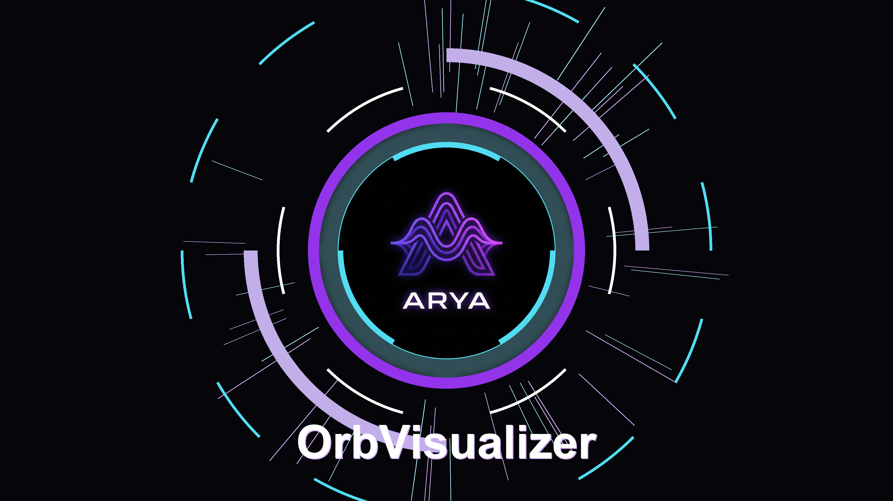
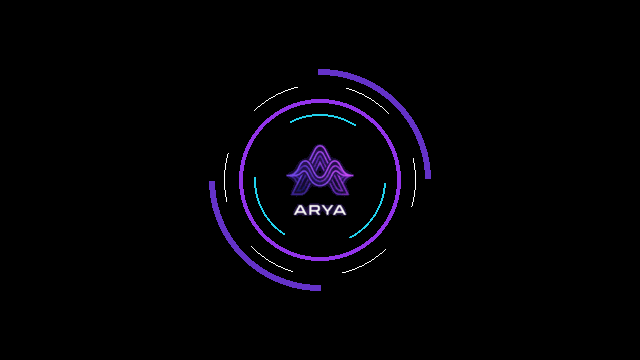

# Arya Video Visualizer



[](https://www.python.org/)
[](LICENSE)
[](https://livekit.io/)

A high-performance, aesthetically pleasing 3D-style particle visualizer for Python applications. Designed for **LiveKit** agents, `Arya Visualizer` creates a dynamic, reactive holographic orb that responds to audio amplitude in real-time.

## 🎥 Demo



## ✨ Features

- **Reactive Animation**: The orb pulses, spins, and expands based on audio loudness.
- **State Management**: Distinct visual states for `listening`, `speaking`, and `thinking`.
- **Particle System**: Dynamic radial bursts and floating particles for a premium feel.
- **Layered Rendering**: Multi-layer composition with a high-res logo, rotating rings, and background effects.
- **LiveKit Integration**: Native support for `rtc.VideoSource` to stream generated frames as a video track.

## 📦 Installation

Clone the repository and install the dependencies:

```bash
git clone https://github.com/janakchoudary/arya-visualizer.git
cd AryaVisualizer
pip install -r requirements.txt
```

## 🚀 Usage

### Basic Integration with LiveKit

```python
from visualizer import AryaVisualizer

# Initialize (standard 720p at 24fps)
viz = AryaVisualizer(width=1280, height=720, fps=24)

# Start the rendering loop
viz.start()

# In your agent's audio loop, update the state and amplitude:
viz.set_state("speaking")
# The visualizer automatically captures frames to viz.source
```

### Updating States

```python
# When the user is talking
viz.set_state("listening")

# When the agent is processing
viz.set_state("thinking")

# When the agent is replying
viz.set_state("speaking")
```

## 🛠 Configuration

You can customize colors, particle count, and speeds by modifying the constants in `visualizer.py`.

- **Colors**: Cyan (`c_cyan`), Purple (`c_purple`), White (`c_white`)
- **Rings**: Adjust `self.rings` in `__init__` to change the orbital rings.
- **Assets**: Replace `Arya.logo.png` with your own transparent PNG logo.

## 📜 License

This project is licensed under the MIT License - see the [LICENSE](LICENSE) file for details.

---
*created with ❤️ by Janak Choudary*
